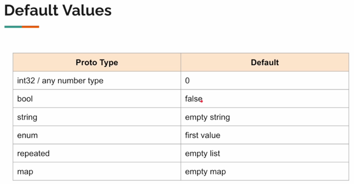
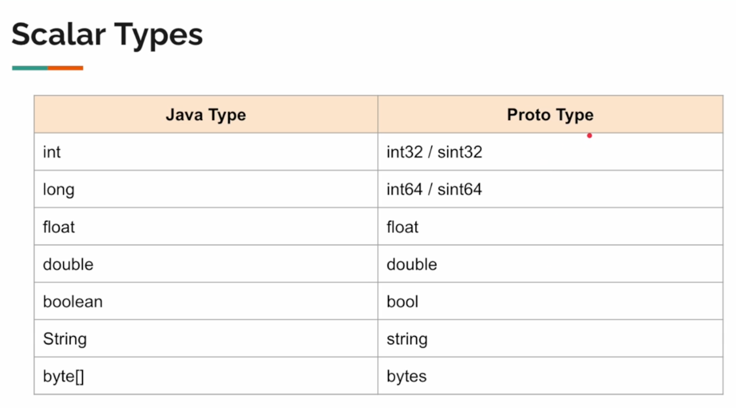
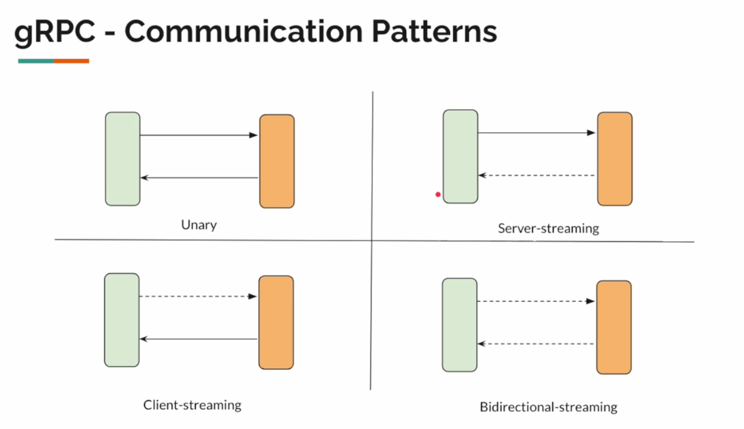
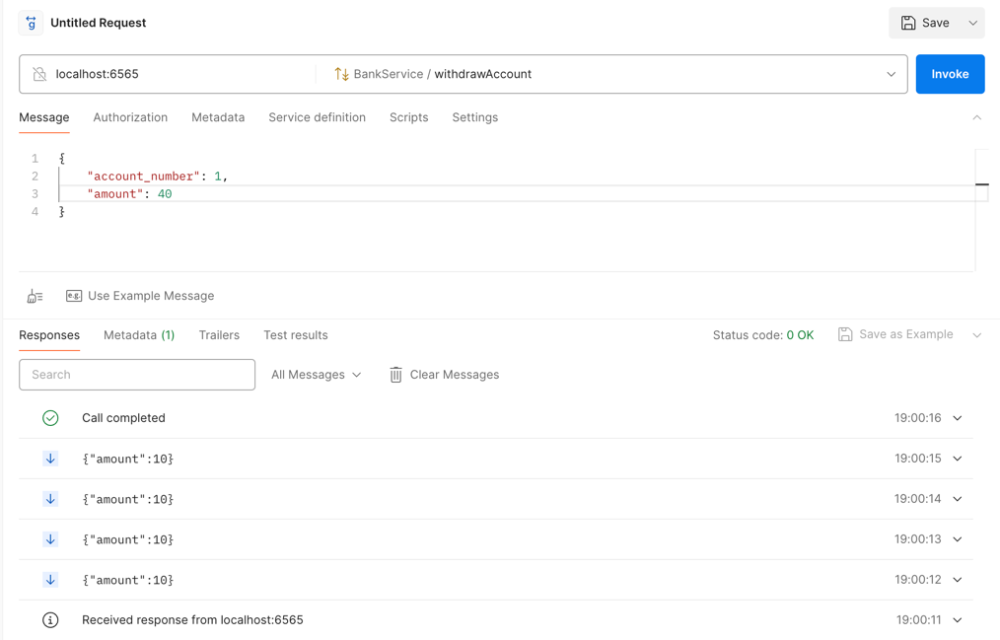
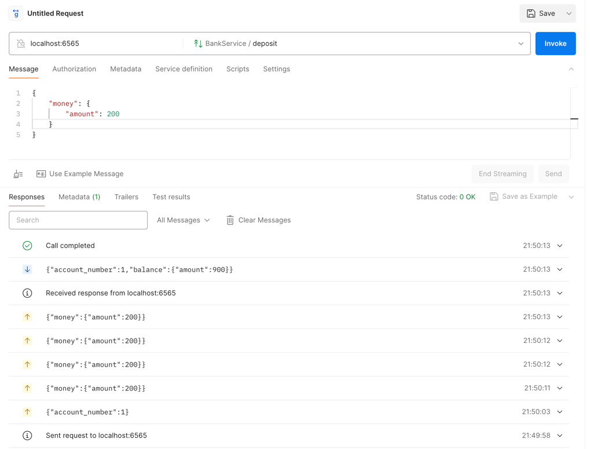
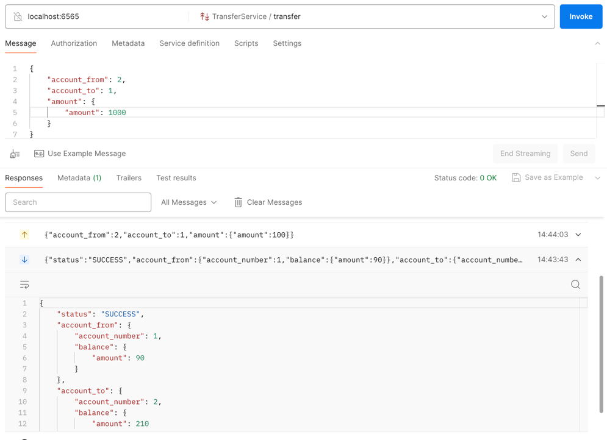
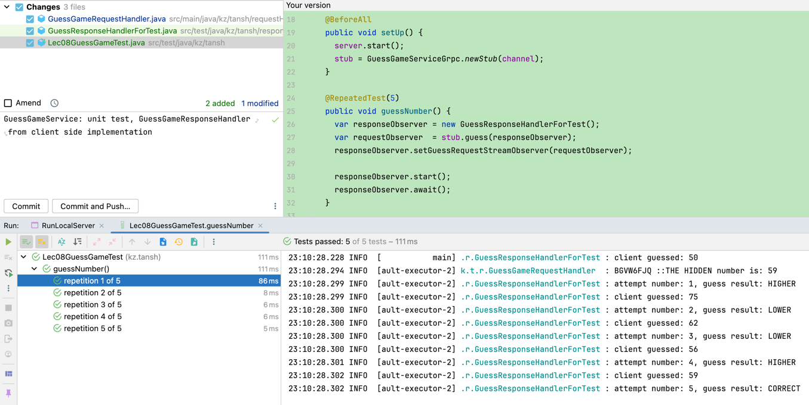
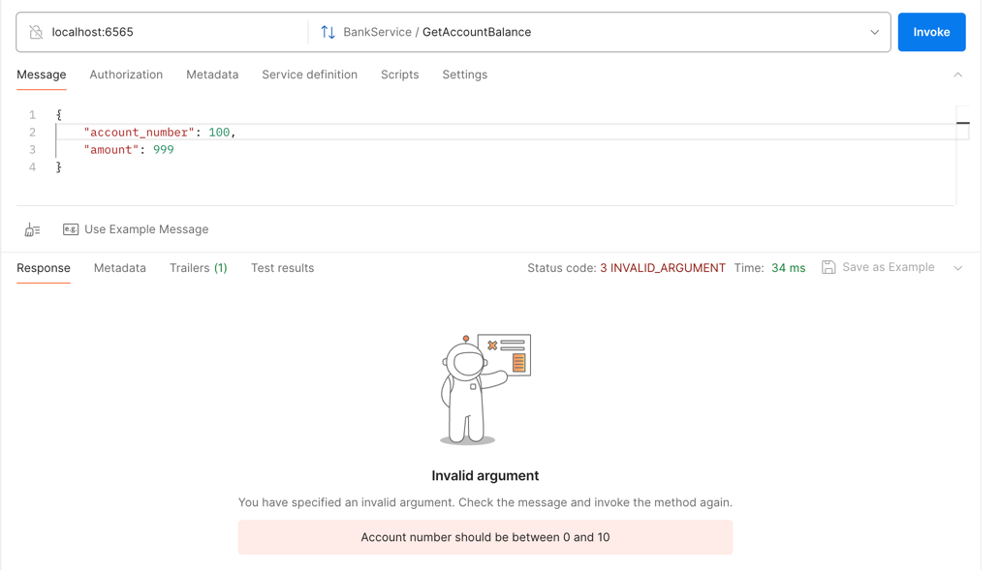
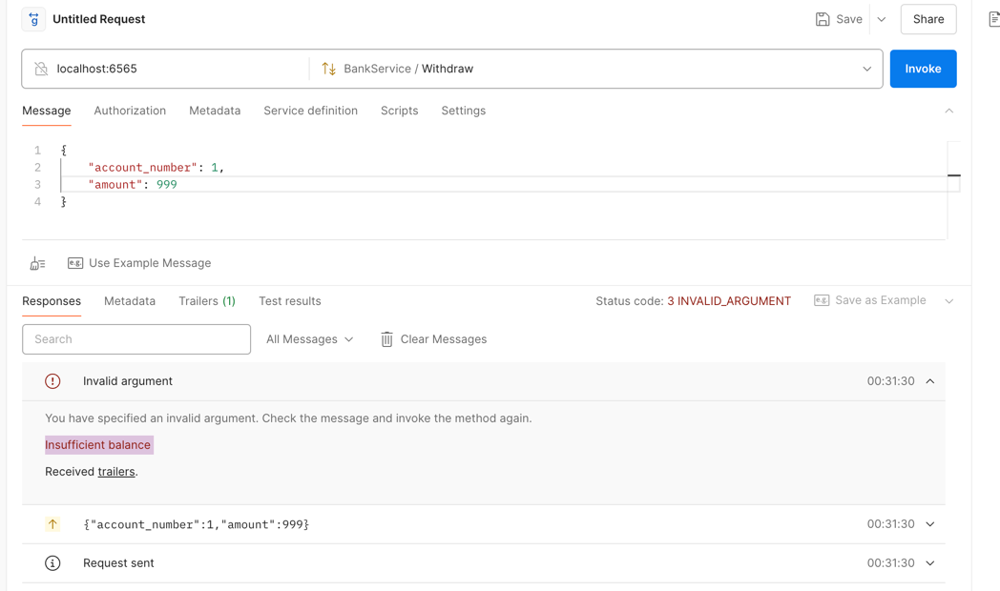
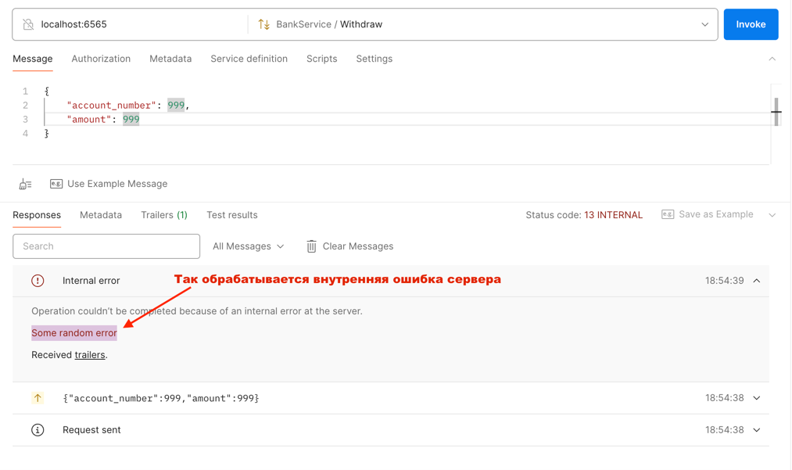

Как прото работает на верхнем уровне?

- для эффективного сжатия каждое поле тегируется числом и идентифициром этим тегом
- наиболее часто используемые тегируйте меньшим числом (от 1 до 16), так они занимают меньше места
- представление в ассоциативном массиве (игнорит поля по умолчанию)
- НЕЛЬЗЯ МЕНЯТЬ ТИП ПОЛЯ
- НЕЛЬЗЯ МЕНЯТЬ ТЭГ ПОЛЯ
- УДАЛЕННЫЙ ТЭГ НУЖНО РЕЗЕРВИРОВАТЬ
- номера тэгов с 1 до 2^29 - 1 
- proto reserved tags 19000-19999

```
tag_number:stored_value
1:sam
2:false (or nothing чтобы экономить место)
3:22
```

## Любое удаленное поле ИЛИ его ТЭГ нужно резервировать чтобы не было проблем со старыми версиями

## Bash
```
./protoc-3.24.0-osx-aarch_64.exe optional.proto --java_out=output
```








- there are 4 different communication patterns in gRPC



## Channel and stub

- channel is created once when server is run
- channel should be private
- stub uses channel
- craete stub like a Singleton Bean - it is thread safe

## Sync / Asyc stub
- Синхронный - ожидает ответа
- Асинхронный - register a listener for call back
- only async stub can support all communication paterns
- future stub and blocking stub support only unary and server streaming
## Java21
- до 21 java 1 джава поток = 1 поток ОС => это дорого с точки зрения оперативной памяти
- Создание синхронной заглушки дорого с точки зрения того что мы создаем для него один поток который ожидает ответа
- вызов синхронных блокирующих стабов эффективней в Java21 за счет virtual threads, а иногда даже по перформансу аналогичен скорости как async stub


## CRUD in gRPC 
- **it is action oriented**
- нет никакого GET, POST маппинга

```protobuf
syntax = "proto3";

message Book {};

message BookId {
  int64 id = 1;
}
message Void {}

service BookService {
  rpc GetBook(BookId) returns (Book);
  rpc SaveBook(Book) returns (Book);
  rpc DeleteBook(BookId) returns (Void);
  rpc UpdateBook(Book) returns (Book);
}
```

## Server streaming
- any periodic updates, like weather, stock price, large file download and etc
- клиенту нет необходимости постоянно вызывать сервер
- gRPC is lightweight to use it in Mobile applications



- gRPC дает гарантию на четкий порядок отправленных сообщений
- если сервер отправляет пачку запросов целиком, быстрее чем клиент успевает обрабатывать - по умолчанию клиент последовательно `one by one sequentially` обрабатывает каждый запрос, 
чтобы распараллелить обработку на стороне клиента можно использовать `ExecutorService`
### Когда использовать стримы, а когда unary call?

#### Stream
- когда рармер ответа неизвестен (сообщение может достигать до 15 ГБ) или большие файлы
- periodic updates (time consuming)
- more efficient when you execute multiple RPC calls
- you need chunks to send data

#### Unary call
- more efficient than streaming RPC
- size is not too big
- operation is not time-consuming
- даже принять моментально getAllAccounts with 100 records это норм для unary call


### Client streaming examples
- Расположение пользователя, геоданные
- IoT устройства (температура, состояние)
- видео стриминг
- загрузка больших файлов

Если клиент со своей стороны прервал стриминг по какой либо ошибке
- хорошее место для коммита - `onCompleted`;
- хорошее место для отката транзакции - `onError`





### BiDirectional Streaming
- game
- chat
- search response (побуквенный ввод и поиск)
- позволяет совершить интерактивный стриминг в зависимости от нагрузки клиента
```java
14:42:06.460 INFO  [           main] kz.tansh.server.GrpcServer     : Server started on port: 6565, services: [v15.BankService, v15.TransferService]
14:43:42.998 INFO  [ault-executor-0] k.t.r.TransferRequestHandler   : success money transfer, from: 1, to: 2, amount: 10
14:44:03.801 INFO  [ault-executor-0] k.t.r.TransferRequestHandler   : success money transfer, from: 2, to: 1, amount: 100
14:44:37.836 INFO  [ault-executor-0] k.t.r.TransferRequestHandler   : transfer completed from the client side, request stream is finished
```



#### Игра в пинг понг, пример реализации фейкового клиента см `GuessGameTest.java`



### Поддержка gRPC с клиента
- be aware of this, потому что гиганты так не делают
- use Envoy proxy between, который передает до браузера HTTP 1.1 
- only unary and server streaming
- **IT DEPENDS**, by w3c specification
- good choice is GraphQL for frontend communication and gRPC in backend communication

### Request validation

```java
// how to setup validation
public class RequestValidator {
  public static Optional<Status> validateAccount(int accountNumber) {
    if (accountNumber > 0 && accountNumber < 10) {
      return Optional.empty();
    }
    return Optional.of(Status.INVALID_ARGUMENT.withDescription("Account number should be between 0 and 10"));
  }

  public static Optional<Status> isAmountDivisibleBy10(int amount) {
    if (amount > 0 && amount % 10 == 0) {
      return Optional.empty();
    }
    return Optional.of(Status.INVALID_ARGUMENT.withDescription("Amount should be divisible by 10"));
  }

  public static Optional<Status> hasEnoughBalance(int amount, int balance) {
    if (amount <= balance) {
      return Optional.empty();
    }
    return Optional.of(Status.INVALID_ARGUMENT.withDescription("Insufficient balance "));
  }
}


// how to use
@Slf4j
public class L18BankService extends BankServiceGrpc.BankServiceImplBase {

  AccountRepository accountRepository = new AccountRepository();

  @Override
  public void getAccountBalance(BankAccount request, StreamObserver<Money> responseObserver) {
    RequestValidator.validateAccount(request.getAccountNumber())
                    .map(Status::asRuntimeException)
                    .ifPresentOrElse(
                        responseObserver::onError,
                        () -> sendAccountBalance(request, responseObserver)
                    );
  }

  private void sendAccountBalance(BankAccount request, StreamObserver<Money> responseObserver) {
    responseObserver.onNext(Money.newBuilder()
                                 .setAmount(accountRepository.getAccount(request.getAccountNumber()).getBalance())
                                 .build());

    responseObserver.onCompleted();
  }
}
```





### Внутренняя ошибка сервера

```java
  @Override
  public void withdraw(WithdrawRequest request, StreamObserver<Money> responseObserver) {
    try {
      if (request.getAccountNumber() == 999) {
        /*
         * Рандомная ошибка сервера. Если не обработать глобальным exception кинет неясное сообщение
         * Operation couldn’t be completed because of an unknown error.
         * Application error processing RPC
         */
        throw new RuntimeException("Some random error");
      }

      RequestValidator.validateAccount(request.getAccountNumber())
                      .or(() -> RequestValidator.hasEnoughBalance(request.getAmount(), accountRepository.getAccount(request.getAccountNumber()).getBalance()))
                      .or(() -> RequestValidator.isAmountDivisibleBy10(request.getAmount()))
                      .map(Status::asRuntimeException)
                      .ifPresentOrElse(
                          responseObserver::onError,
                          () -> sendMoney(request, responseObserver)
                      );
    } catch (Exception e) {
      // благодаря этому блоку обработается рандомная серверная ошибка
      responseObserver.onError(Status.INTERNAL.withDescription(e.getMessage()).asRuntimeException());
    }
  }
```



###
- (gRPC использует HTTP/2 для передачи данных, он также определяет свой собственный протокол сериализации сообщений и механизмы RPC поверх HTTP/2. Эти механизмы включают в себя коды статуса и ошибок, которые могут отличаться от стандартных кодов состояния HTTP/2.)

### Metadata
- grpc has something called Trailers - это заголовки отправляемые сервером во время завершения запроса
- содержат информацию о статусе РПС вызова
- Metadata отправляются в ответе инициаторе
- Metadata == Headers
- Trailers can contain application specific status codes
- Обычные grpc Status - general status codes

## Безопасность SSL/TLS
- tls is upgraded version of ssl
- jks is Java Keystore
```
grpc.keystore.jks    // private key / digital certificates
grpc.truststore.jks  // public key  / trusted certificates
```

# Создание сертификатов для локального тестирования

```bash
#!/bin/bash

# CA creates private key and root CA certificate
openssl genrsa -out root.key
openssl req -new -x509 -key root.key -out root.crt  -subj "/CN=localhost" -nodes

# keystore
keytool -keystore grpc.keystore.jks -storepass changeit -alias localhost -validity 3650 -genkey -keyalg RSA -dname "CN=localhost"

# create CSR (certificate signing request)
keytool -keystore grpc.keystore.jks -storepass changeit -alias localhost -certreq -file grpc-signing-request.crt

# CA signs the certificate
openssl x509 -req -CA root.crt -CAkey root.key -in grpc-signing-request.crt -out grpc-signed.crt -days 3650 -CAcreateserial

# We can import root CA cert & our signed certificate
# This should be private and owned by the server
keytool -keystore grpc.keystore.jks -storepass changeit -alias CARoot -import -file root.crt -noprompt
keytool -keystore grpc.keystore.jks -storepass changeit -alias localhost -import -file grpc-signed.crt -noprompt

# This is for clients
keytool -keystore grpc.truststore.jks -storepass changeit -noprompt -alias CARoot -import -file root.crt
```
